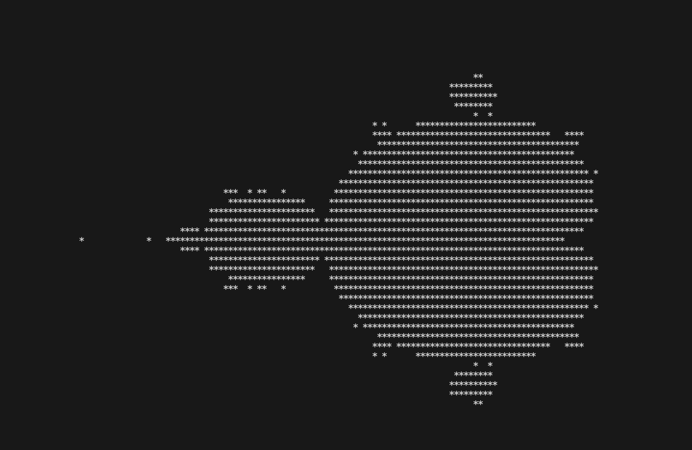
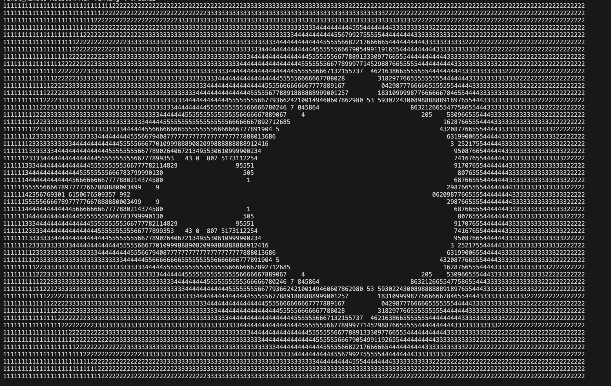

FUN is a simple, structured, dynamic, functional and high-level programming language.

FUN's syntax is simple and clear. It contains expressions and declerations.

```scala
abstract class Exp 
abstract class BExp 
abstract class Decl

case class Var(s: String) extends Exp
case class Num(i: Int) extends Exp
case class Aop(o: String, a1: Exp, a2: Exp) extends Exp 
case class If(a: BExp, e1: Exp, e2: Exp) extends Exp
case class Write(e: Exp) extends Exp
case class Sequ(e1: Exp, e2: Exp) extends Exp
case class Call(name: String, args: List[Exp]) extends Exp

case class Bop(o: String, a1: Exp, a2: Exp) extends BExp

case class Def(name: String,
                args: List[String],
                body: Exp) extends Decl 

case class Main(e: Exp) extends Decl
```

The `fun_llvm.sc` compiler targets the LLVM Intermediate Language, or LLVM Intermediate
Representation (short LLVM‐IR). LLVM-IR will also allow us to benefit from the modular 
structure of the LLVM compiler and let for example the compiler generate code for 
different CPUs, like X86 or ARM. LLVM‐IR allows compilation of multiple source 
languages to multiple targets. It is also the place where most of the target 
independent optimisations are performed.

However, what we have to do for LLVM is to generate code in Static Single-Assignment 
format (short SSA), because that is what the LLVM‐IR expects from us. The main idea 
behind the SSA format is to use very simple variable assignments where every variable 
is assigned only once.

Compilers have to solve the problem of bridging the gap between “high‐level” programs 
and “low‐level” hardware. If the gap is too wide for one step, then a good strategy is 
to lay a stepping stone somewhere in between. We will use our own stepping stone which 
I call the K‐language. K‐values are the atomic operations that can be on the right‐hand 
side of equal‐signs. The K‐language is restricted such that it is easy to generate the 
SSA format for the LLVM‐IR.

```scala
// K-language (K-expressions , K-values)
abstract class KExp
abstract class KVal

case class KVar(s: String) extends KVal
case class KNum(i: Int) extends KVal
case class Kop(o: String, v1: KVal, v2: KVal) extends KVal
case class KCall(o: String, vrs: List[KVal]) extends KVal
case class KWrite(v: KVal) extends KVal

case class KIf(x1: String, e1: KExp, e2: KExp) extends KExp
case class KLet(x: String, v: KVal, e: KExp) extends KExp
case class KReturn(v: KVal) extends KExp
```

The main difficulty of generating instructions in SSA format is that large compound 
expressions need to be broken up into smaller pieces and intermediate results need to 
be chained into later instructions. To do this conveniently, CPS‐translations have been 
developed. They use functions (“continuations”) to represent what is coming next in a 
sequence of instructions. Continuations are functions of type KVal to KExp. They can be 
seen as a sequence of KLets where there is a “hole” that needs to be filled.

## Build

The 6 simple FUN programs include:
- defs.fun
- fact.fun
- hanoi.fun
- mand.fun
- mand2.fun
- sqr.fun

To install ammonite repl:

```zsh
// Linux
$ curl -L https://github.com/lihaoyi/ammonite/releases/download/3.0.0-M2/2.13-3.0.
0-M2-bootstrap > amm && chmod +x amm

// Mac
$ brew install ammonite-repl
```

To run the compiler:
```zsh
$ amm fun_llvm.sc run fact.fun
$ amm fun_llvm.sc run mand.fun
```

Sample ascii output from the Mandelbrot programs:


